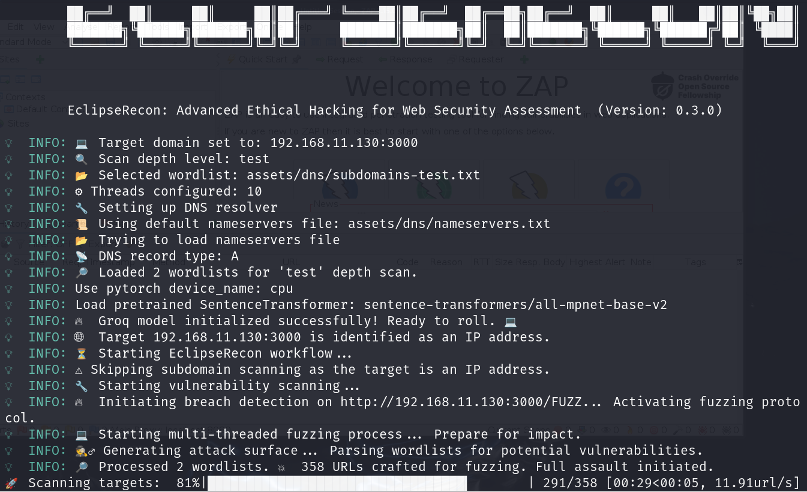
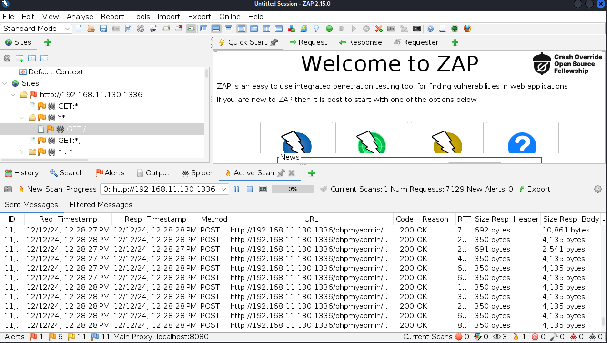
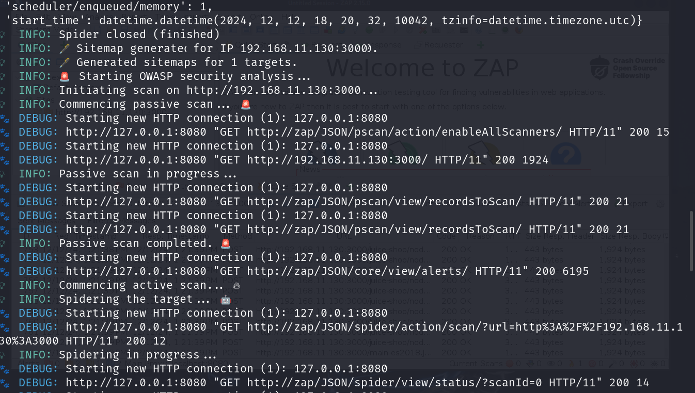
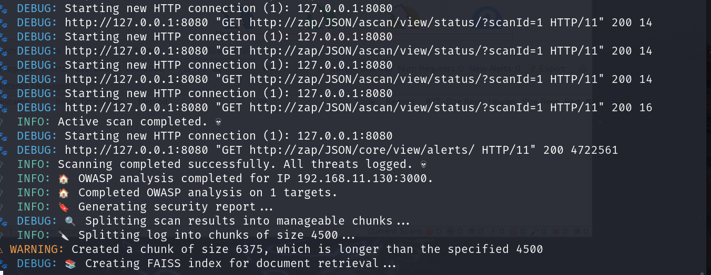
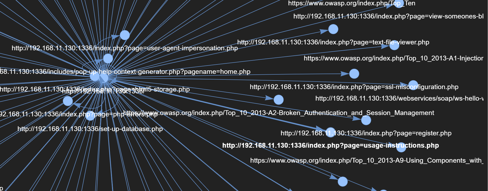
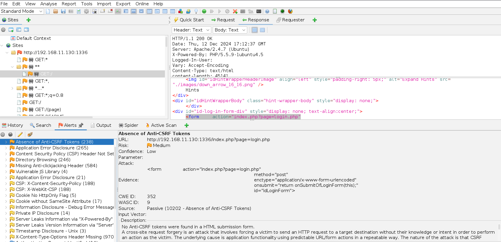
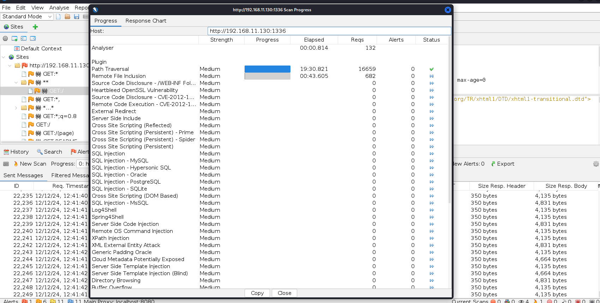
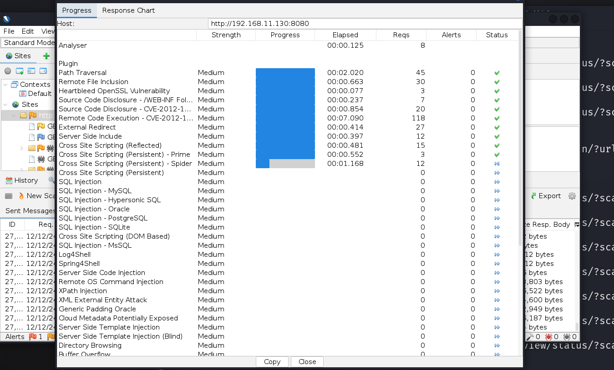

#  EclipseRecon 🌑 — A Personal Tool for Learning Web Reconnaissance

EclipseRecon is an educational web reconnaissance tool developed as a practical exercise during a cybersecurity training course. 🧠🕵️‍♂️ Its main objective is to help learners understand how information gathering works in the context of ethical hacking and web application security. Through this project, key concepts such as subdomain enumeration, vulnerability discovery, and structural mapping of websites were explored in a hands-on manner. 💻🔍

By applying real-world techniques in a controlled and legal environment, EclipseRecon provides an opportunity to reinforce theoretical knowledge with practical skills. Whether you're a student preparing for a role in cybersecurity or simply exploring ethical hacking practices, this tool aims to support your learning journey and deepen your understanding of how to assess and protect web environments. 🔐🎓

🙏 I would like to express my sincere gratitude to [Santiago Hernández, a leading expert in Cybersecurity and Artificial Intelligence](https://www.udemy.com/user/shramos/). His outstanding course on **Cybersecurity and Ethical Hacking**, available on Udemy, was instrumental in the development of this project. The insights and techniques I gained from his course were invaluable in guiding my approach to cybersecurity practices. Thank you for sharing your knowledge and expertise!

> ⚠️ **Disclaimer**: This tool is intended for ethical hacking and educational purposes only. Always ensure you have authorization before testing any systems.

> ⚠️ All tests and security analysis workflows in **EclipseRecon** were conducted in a controlled environment using deliberately vulnerable websites based on the VPLE (Vulnerable Web Platform for Learning and Exploitation) virtual machine, which is designed specifically for security testing and training purposes. This testing was carried out in a dedicated **lab environment** to ensure ethical use and avoid unauthorized access to any external systems. The results of these tests demonstrate the tool’s effectiveness in identifying vulnerabilities in a controlled, safe, and legal environment.
> 
<p align="center">
  
  
  
</p>

<p align="center">
  
</p>

## 🎯 Purpose

**EclipseRecon** was developed as a practical project during a cybersecurity course to reinforce web reconnaissance techniques through hands-on experience. It aims to help students and aspiring ethical hackers learn how to:

- 🕵️‍♂️ **Discover Hidden Subdomains**: Practice subdomain enumeration to reveal potential entry points.
- 🔒 **Scan for Vulnerabilities**: Identify common weaknesses that could affect web security.
- 🌐 **Crawl Websites**: Understand website structure by mapping and analyzing content.
- 🚨 **OWASP-Compliant Security Analysis**: Perform basic assessments aligned with OWASP guidelines.
- 📊 **Generate Comprehensive Reports**: Practice creating PDF and JSON reports to document findings.

This tool combines several reconnaissance methods into one educational platform, making it easier to learn how different techniques work together during a security assessment.

## 🛠 Features

- 🌍 **Subdomain Scanning**: Gain visibility into a site’s subdomain landscape.
- 🔧 **Vulnerability Analysis**: Learn to detect common issues in web applications.
- 🧭 **Website Crawling**: Build sitemaps and extract page data to better understand web architecture.
- 📋 **OWASP Testing**: Get familiar with the OWASP testing methodology through guided scans.
- 📝 **Detailed Reporting**: Export structured results in PDF and JSON formats for review and learning.

<p align="center">
  
</p>

<p align="center">
  
</p>

## 🔧💻 Requirements

To run EclipseRecon, make sure you have the following dependencies installed:

- 🐍 **Python 3.8+**: Required for running EclipseRecon scripts and managing dependencies.
- 🌐 **colorama==0.4.6**: Used for adding colored output to the console for better readability.
- 🔍 **dnspython==2.7.0**: DNS toolkit for subdomain scanning and resolution.
- ⏳ **tqdm==4.67.1**: Progress bar for tracking scanning and crawling processes.
- 🌐 **aiohttp==3.11.9**: HTTP client/server library for asynchronous web crawling and scanning.
- 📊 **pyvis==0.3.2**: Visualization library for creating interactive network graphs of subdomains and vulnerabilities.
- 🕸️ **scrapy==2.12.0**: Web scraping framework for crawling websites and generating sitemaps.
- 🔐 **zaproxy==0.3.2**: Used for automated vulnerability scanning and OWASP-compliant security testing.
- 🗝️ **python-dotenv==1.0.1**: For managing environment variables, particularly for proxy settings.
- 🧠 **langchain==0.2.16**: For handling advanced language models and AI-based security analysis.
- 🤖 **langchain-groq==0.1.10**: Integration with Groq's AI model for cloud-based processing.
- 📄 **fpdf2==2.8.1**: Library for generating PDF reports from scan results.
- 🧩 **langchain-community==0.2.13**: For enhanced community-driven features in LangChain.
- 🧠 **langchain-huggingface==0.0.3**: For integrating HuggingFace embeddings into the security analysis workflow.
- 🔍 **faiss-cpu==1.9.0**: For performing efficient similarity search and retrieval in the analysis process.

Make sure to install these dependencies using `pip install -r requirements.txt` to get started!

<p align="center">
  
</p>

<p align="center">
  
</p>

## 🌍 Practical Use Cases

EclipseRecon was developed as part of a learning process to explore real-world web reconnaissance techniques. While it’s not intended for production use, it offers practical value in educational and training contexts such as:

1. 🛡️ **Penetration Testing Practice**: Simulate asset enumeration and identify common weaknesses in lab environments to understand the core phases of a penetration test.  
2. 🪲 **Bug Bounty Simulations**: Practice participating in bug bounty programs by learning how to identify hidden entry points, subdomains, and potential vulnerabilities in controlled scenarios.  
3. 📊 **Security Auditing Training**: Gain experience in mapping an organization's digital footprint and documenting findings through structured reports.  
4. ✅ **Compliance Familiarization**: Apply OWASP-based checks to understand how security standards work in practice and what it means to align assessments with industry-recognized frameworks.  

This project is ideal for students, ethical hacking enthusiasts, and anyone learning how to responsibly conduct reconnaissance and vulnerability discovery in a safe, hands-on way. 🚀

<p align="center">
  
</p>

<p align="center">
  
</p>

## 📋 Workflow
Here’s a step-by-step breakdown of what EclipseRecon does:

1. **🧭 Initialization**:
   - Validates the target (IP address or domain).
   - Configures proxies and scanning depth.
2. **🔎 Subdomain Scanning**:
   - Discovers subdomains using the `SubdomainScanner` module.
   - Outputs a list of discovered subdomains.
3. **🔧 Vulnerability Scanning**:
   - Scans discovered subdomains or the target for vulnerabilities.
   - Leverages the `WebVulnerabilityScanner` to find potential risks.
4. **🕷️ Website Crawling**:
   - Generates sitemaps by crawling websites or subdomains.
   - Uses the `WebsiteSpider` to map the site structure.
5. **🛡️ OWASP Analysis**:
   - Performs OWASP security checks on targets.
   - Uses the `OwaspSecurityScanner` for detailed testing.
6. **📄 Report Generation**:
   - Compiles results into PDF and JSON reports.
   - Uses the `SecurityAnalyzer` to generate professional-grade reports.

## 🌐 EclipseRecon CLI Options & Usage

EclipseRecon is a powerful tool for reconnaissance and security analysis of websites and IP addresses. Below is a breakdown of the available options for the command-line interface (CLI).

### 📝 Available Options:

### 1. `--target` (Required) 🌍
**Description**: The target domain or IP address that you want to scan. This is a required argument and must be provided.

### 2. `--scan_depth` (Optional) 🔍
**Description**: Set the depth of the subdomain scanning. You can choose from the following options:
- `test`: Basic scan for subdomains.
- `basic`: A deeper scan than `test`, but not as extensive.
- `normal`: A balanced scan (default).
- `deep`: Full-depth scan for all possible subdomains.

**Default**: `normal`

### 3. `--ipv6` (Optional) 🌐
**Description**: Enable scanning of IPv6 addresses (default is IPv4). Use this option if you want to scan for IPv6 addresses.

### 4. `--threads` (Optional) ⚡
**Description**: Define the number of threads to use for scanning. More threads will speed up the process but may consume more resources.

**Default**: `10`

### 5. `--proxies` (Optional) 🔒
**Description**: Set a proxy for the OWASP security scanner to route traffic through a proxy server (e.g., for anonymity or bypassing firewalls).

### 6. `--pdf_report` (Optional) 📄
**Description**: Path to save the PDF security report. If not specified, the report will be saved with the default name `security_report.pdf`.

### 7. `--json_report` (Optional) 📊
**Description**: Path to save the JSON security report. If not specified, the report will be saved with the default name `security_report.json`.

### 8. `--version` (Optional) ℹ️
**Description**: Displays the version of EclipseRecon.

### 📋 Summary of CLI Options

| Option            | Description                                                   | Default               |
|-------------------|---------------------------------------------------------------|-----------------------|
| `--target`        | The target domain or IP address to scan.                      | Required              |
| `--scan_depth`    | Subdomain scan depth: `test`, `basic`, `normal`, `deep`.       | `normal`              |
| `--ipv6`          | Enable IPv6 scanning (optional).                              | Disabled              |
| `--threads`       | Number of threads for scanning (default is 10).               | `10`                  |
| `--proxies`       | Proxy settings for the OWASP scanner.                         | None                  |
| `--pdf_report`    | Path to save the PDF security report.                         | `security_report.pdf` |
| `--json_report`   | Path to save the JSON security report.                        | `security_report.json`|
| `--version`       | Displays the version of EclipseRecon.                         | None                  |


Now you can use these options to scan websites or IP addresses for vulnerabilities, subdomains, OWASP security issues, and more. 🚀

<p align="center">
  
</p>

<p align="center">
  
</p>

<p align="center">
  
</p>

## ⚠️ Disclaimer  

**EclipseRecon** was developed **exclusively for educational and research purposes** as part of my **cybersecurity learning journey**. This project serves as a **practical application of the techniques acquired during my ethical hacking training**, allowing me to **experiment in a controlled environment** and showcase my **cybersecurity portfolio**.  

This tool is intended **only for ethical security assessments and authorized penetration testing**. It must **never be used on systems without explicit permission** from the owner.  

All testing conducted with **EclipseRecon** was performed in a **dedicated cybersecurity lab environment** using **deliberately vulnerable systems**, such as the **VPLE (Vulnerable Web Platform for Learning and Exploitation)** virtual machine, which is designed for **security research and training purposes**.  

Any **unauthorized use of EclipseRecon to scan, enumerate, or exploit real-world systems without proper authorization** is **illegal**.

**I disclaim any responsibility for misuse of this tool.** Users must ensure they operate **within legal and ethical boundaries** at all times.  

## Acknowledgements 🙏

🙏 I would like to express my sincere gratitude to [Santiago Hernández, a leading expert in Cybersecurity and Artificial Intelligence](https://www.udemy.com/user/shramos/). His outstanding course on **Cybersecurity and Ethical Hacking**, available on Udemy, was instrumental in the development of this project. The insights and techniques I gained from his course were invaluable in guiding my approach to cybersecurity practices. Thank you for sharing your knowledge and expertise!

EclipseRecon extends its gratitude to the creators and maintainers of the [SecLists](https://github.com/danielmiessler/SecLists) repository. SecLists has been an invaluable resource for security practitioners, offering an extensive collection of lists, including usernames, passwords, sensitive data patterns, fuzzing payloads, and subdomain dictionaries. These resources have significantly contributed to the capabilities of EclipseRecon, particularly in tasks such as fuzzing and subdomain scanning.  

Special thanks to **Daniel Miessler**, **Jason Haddix**, and **g0tmi1k** for their dedication to maintaining and expanding this essential tool for the cybersecurity community. Your work empowers ethical hackers and security analysts worldwide to perform more efficient and comprehensive assessments. 🙌  

Special thanks to the open-source community and the contributors who have made this project possible.

## License ⚖️

This project is licensed under the MIT License, an open-source software license that allows developers to freely use, copy, modify, and distribute the software. 🛠️ This includes use in both personal and commercial projects, with the only requirement being that the original copyright notice is retained. 📄

Please note the following limitations:

- The software is provided "as is", without any warranties, express or implied. 🚫🛡️
- If you distribute the software, whether in original or modified form, you must include the original copyright notice and license. 📑
- The license allows for commercial use, but you cannot claim ownership over the software itself. 🏷️

The goal of this license is to maximize freedom for developers while maintaining recognition for the original creators.

```
MIT License

Copyright (c) 2024 Dream software - Sergio Sánchez 

Permission is hereby granted, free of charge, to any person obtaining a copy
of this software and associated documentation files (the "Software"), to deal
in the Software without restriction, including without limitation the rights
to use, copy, modify, merge, publish, distribute, sublicense, and/or sell
copies of the Software, and to permit persons to whom the Software is
furnished to do so, subject to the following conditions:

The above copyright notice and this permission notice shall be included in all
copies or substantial portions of the Software.

THE SOFTWARE IS PROVIDED "AS IS", WITHOUT WARRANTY OF ANY KIND, EXPRESS OR
IMPLIED, INCLUDING BUT NOT LIMITED TO THE WARRANTIES OF MERCHANTABILITY,
FITNESS FOR A PARTICULAR PURPOSE AND NONINFRINGEMENT. IN NO EVENT SHALL THE
AUTHORS OR COPYRIGHT HOLDERS BE LIABLE FOR ANY CLAIM, DAMAGES OR OTHER
LIABILITY, WHETHER IN AN ACTION OF CONTRACT, TORT OR OTHERWISE, ARISING FROM,
OUT OF OR IN CONNECTION WITH THE SOFTWARE OR THE USE OR OTHER DEALINGS IN THE
SOFTWARE.
```


