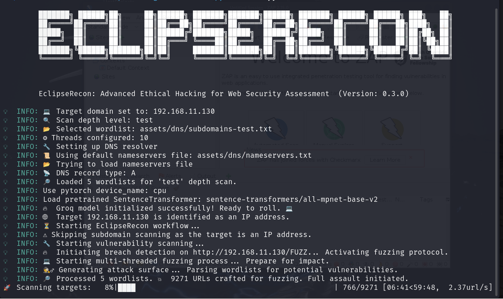

# EclipseRecon: 🌑 Unveiling the Shadows of the Web 🌐

EclipseRecon is a powerful and stealthy web reconnaissance tool designed to uncover hidden vulnerabilities, subdomains, and intricate site structures that may otherwise remain in the dark. 🕵️‍♂️💻 Using advanced scanning techniques, EclipseRecon enables security professionals to perform thorough assessments of web applications, revealing critical attack surfaces with precision. 🚨🔍 Whether you're conducting penetration testing, vulnerability assessments, or preparing for a cyber defense, EclipseRecon ensures you're always one step ahead in identifying weak spots before malicious actors can exploit them. 🔐💥 With its dark, investigative approach, EclipseRecon helps you stay ahead of potential threats and secure your digital environment.

🙏 I would like to express my sincere gratitude to [Santiago Hernández, a leading expert in Cybersecurity and Artificial Intelligence](https://www.udemy.com/user/shramos/). His outstanding course on **Cybersecurity and Ethical Hacking**, available on Udemy, was instrumental in the development of this project. The insights and techniques I gained from his course were invaluable in guiding my approach to cybersecurity practices. Thank you for sharing your knowledge and expertise!

> ⚠️ **Disclaimer**: This tool is intended for ethical hacking and educational purposes only. Always ensure you have authorization before testing any systems.

> ⚠️ All tests and security analysis workflows in **EclipseRecon** were conducted in a controlled environment using deliberately vulnerable websites based on the VPLE (Vulnerable Web Platform for Learning and Exploitation) virtual machine, which is designed specifically for security testing and training purposes. This testing was carried out in a dedicated **lab environment** to ensure ethical use and avoid unauthorized access to any external systems. The results of these tests demonstrate the tool’s effectiveness in identifying vulnerabilities in a controlled, safe, and legal environment.
> 
<p align="center">
  
  
  
</p>

<p align="center">
  
</p>

## 🌟 **Explore My Other Open-Source Ethical Hacking Tools**

If you're passionate about ethical hacking and want to elevate your cybersecurity toolkit, make sure to explore my suite of open-source projects. These tools are designed to empower penetration testers and cybersecurity professionals by streamlining complex tasks, enhancing security audits, and uncovering vulnerabilities with cutting-edge precision:

- [🦅 **NetHawk**](https://github.com/sergio11/nethawk_analyzer): A state-of-the-art **AI-powered ethical hacking tool** for **network vulnerability assessment**. Using advanced frameworks like **Scapy** and **Nmap**, NetHawk automates **port scanning**, **vulnerability detection**, and **report generation**, making security audits faster, smarter, and more efficient. Whether you're a **network administrator**, **cybersecurity expert**, or **ethical hacker**, NetHawk simplifies the assessment process and offers actionable insights to fortify your systems.  
- [💀 **Nemesys**](https://github.com/sergio11/nemesys): An advanced **exploitation** and **post-exploitation** tool built on top of the **Metasploit Framework** for automating critical data harvesting and system enumeration.
- [🕷️ **BlackVenom**](https://github.com/sergio11/blackvenom): The ultimate **ARP** and **DNS spoofing** tool, designed to intercept network traffic and uncover vulnerabilities with stealth and precision. A must-have for identifying and mitigating **network-level threats**.  

- [🌐 **ZeroTrace**](https://github.com/sergio11/zero_trace_hacking_tool): A robust **search engine dorking** tool for identifying potential **attack vectors** and locating **sensitive exposed information** across the web. Perfect for cybersecurity professionals aiming to enhance reconnaissance during penetration testing.  

- [🔐 **DecryptX**](https://github.com/sergio11/decryptx): An **advanced hash and password security assessment tool** that empowers you to analyze **password hashes**, **encrypted ZIP files**, and more. Ideal for evaluating the strength of encryption and identifying weaknesses in **security implementations**.  

These tools are designed to streamline penetration testing, enhance security assessments, and provide in-depth insights into vulnerabilities. Explore them to level up your ethical hacking skills! 💻🔍

## 🎯 Purpose
EclipseRecon is designed to empower ethical hackers, security analysts, and penetration testers with the tools to:

- 🕵️‍♂️ **Discover Hidden Subdomains**: Uncover subdomains that could expose critical attack surfaces.
- 🔒 **Scan for Vulnerabilities**: Identify common vulnerabilities that might put your web assets at risk.
- 🌐 **Crawl Websites**: Map out websites and gain valuable security insights from their structure.
- 🚨 **OWASP-Compliant Security Analysis**: Perform in-depth security checks based on OWASP's top security practices.
- 📊 **Generate Comprehensive Reports**: Create detailed PDF and JSON reports for easy sharing and analysis.

By streamlining multiple scanning techniques, EclipseRecon helps save time, increase precision, and enhance overall efficiency during security assessments and penetration testing.

## 🛠 Features
- 🌍 **Subdomain Scanning**: Quickly discover subdomains to get a broader view of the attack surface.
- 🔧 **Vulnerability Analysis**: Detect security weaknesses in web applications and associated resources.
- 🧭 **Website Crawling**: Automatically crawl websites and generate sitemaps to analyze the site's structure.
- 📋 **OWASP Testing**: Conduct robust security testing in line with the OWASP security testing methodology.
- 📝 **Detailed Reporting**: Export your findings in easy-to-read PDF and JSON formats for in-depth analysis and reporting.

## 🔧💻 Requirements

To run EclipseRecon, make sure you have the following dependencies installed:

- 🐍 **Python 3.8+**: Required for running EclipseRecon scripts and managing dependencies.
- 🌐 **colorama==0.4.6**: Used for adding colored output to the console for better readability.
- 🔍 **dnspython==2.7.0**: DNS toolkit for subdomain scanning and resolution.
- ⏳ **tqdm==4.67.1**: Progress bar for tracking scanning and crawling processes.
- 🌐 **aiohttp==3.11.9**: HTTP client/server library for asynchronous web crawling and scanning.
- 📊 **pyvis==0.3.2**: Visualization library for creating interactive network graphs of subdomains and vulnerabilities.
- 🕸️ **scrapy==2.12.0**: Web scraping framework for crawling websites and generating sitemaps.
- 🔐 **zaproxy==0.3.2**: Used for automated vulnerability scanning and OWASP-compliant security testing.
- 🗝️ **python-dotenv==1.0.1**: For managing environment variables, particularly for proxy settings.
- 🧠 **langchain==0.2.16**: For handling advanced language models and AI-based security analysis.
- 🤖 **langchain-groq==0.1.10**: Integration with Groq's AI model for cloud-based processing.
- 📄 **fpdf2==2.8.1**: Library for generating PDF reports from scan results.
- 🧩 **langchain-community==0.2.13**: For enhanced community-driven features in LangChain.
- 🧠 **langchain-huggingface==0.0.3**: For integrating HuggingFace embeddings into the security analysis workflow.
- 🔍 **faiss-cpu==1.9.0**: For performing efficient similarity search and retrieval in the analysis process.

Make sure to install these dependencies using `pip install -r requirements.txt` to get started!

## 🌍 Practical Use Cases

EclipseRecon empowers cybersecurity professionals with versatile applications, including:

1. 🛡️ **Penetration Testing**: Streamline asset enumeration and uncover weaknesses in target infrastructures with precision.  
2. 🪲 **Bug Bounty Hunting**: Participate in bug bounty programs—initiatives where organizations reward security researchers for identifying and responsibly reporting vulnerabilities in their systems. EclipseRecon helps you uncover hidden entry points, subdomains, and weaknesses to enhance your findings.  
3. 📊 **Security Auditing**: Conduct comprehensive digital footprint analysis and generate detailed reports to assess an organization's security posture.  
4. ✅ **Compliance Checks**: Perform in-depth evaluations aligned with **OWASP** (Open Web Application Security Project) standards, a globally recognized framework for identifying and mitigating the most critical security risks in web applications. EclipseRecon ensures your systems meet the necessary benchmarks for security compliance.  

Whether you're a penetration tester, bug bounty hunter, or security analyst, EclipseRecon is your go-to tool for effective reconnaissance and vulnerability discovery. 🚀

## 📋 Workflow
Here’s a step-by-step breakdown of what EclipseRecon does:

1. **🧭 Initialization**:
   - Validates the target (IP address or domain).
   - Configures proxies and scanning depth.
2. **🔎 Subdomain Scanning**:
   - Discovers subdomains using the `SubdomainScanner` module.
   - Outputs a list of discovered subdomains.
3. **🔧 Vulnerability Scanning**:
   - Scans discovered subdomains or the target for vulnerabilities.
   - Leverages the `WebVulnerabilityScanner` to find potential risks.
4. **🕷️ Website Crawling**:
   - Generates sitemaps by crawling websites or subdomains.
   - Uses the `WebsiteSpider` to map the site structure.
5. **🛡️ OWASP Analysis**:
   - Performs OWASP security checks on targets.
   - Uses the `OwaspSecurityScanner` for detailed testing.
6. **📄 Report Generation**:
   - Compiles results into PDF and JSON reports.
   - Uses the `SecurityAnalyzer` to generate professional-grade reports.

## 🌐 EclipseRecon CLI Options & Usage

EclipseRecon is a powerful tool for reconnaissance and security analysis of websites and IP addresses. Below is a breakdown of the available options for the command-line interface (CLI).

### 📝 Available Options:

### 1. `--target` (Required) 🌍
**Description**: The target domain or IP address that you want to scan. This is a required argument and must be provided.

### 2. `--scan_depth` (Optional) 🔍
**Description**: Set the depth of the subdomain scanning. You can choose from the following options:
- `test`: Basic scan for subdomains.
- `basic`: A deeper scan than `test`, but not as extensive.
- `normal`: A balanced scan (default).
- `deep`: Full-depth scan for all possible subdomains.

**Default**: `normal`

### 3. `--ipv6` (Optional) 🌐
**Description**: Enable scanning of IPv6 addresses (default is IPv4). Use this option if you want to scan for IPv6 addresses.

### 4. `--threads` (Optional) ⚡
**Description**: Define the number of threads to use for scanning. More threads will speed up the process but may consume more resources.

**Default**: `10`

### 5. `--proxies` (Optional) 🔒
**Description**: Set a proxy for the OWASP security scanner to route traffic through a proxy server (e.g., for anonymity or bypassing firewalls).

### 6. `--pdf_report` (Optional) 📄
**Description**: Path to save the PDF security report. If not specified, the report will be saved with the default name `security_report.pdf`.

### 7. `--json_report` (Optional) 📊
**Description**: Path to save the JSON security report. If not specified, the report will be saved with the default name `security_report.json`.

### 8. `--version` (Optional) ℹ️
**Description**: Displays the version of EclipseRecon.

### 📋 Summary of CLI Options

| Option            | Description                                                   | Default               |
|-------------------|---------------------------------------------------------------|-----------------------|
| `--target`        | The target domain or IP address to scan.                      | Required              |
| `--scan_depth`    | Subdomain scan depth: `test`, `basic`, `normal`, `deep`.       | `normal`              |
| `--ipv6`          | Enable IPv6 scanning (optional).                              | Disabled              |
| `--threads`       | Number of threads for scanning (default is 10).               | `10`                  |
| `--proxies`       | Proxy settings for the OWASP scanner.                         | None                  |
| `--pdf_report`    | Path to save the PDF security report.                         | `security_report.pdf` |
| `--json_report`   | Path to save the JSON security report.                        | `security_report.json`|
| `--version`       | Displays the version of EclipseRecon.                         | None                  |


Now you can use these options to scan websites or IP addresses for vulnerabilities, subdomains, OWASP security issues, and more. 🚀

## ⚠️ Disclaimer

**EclipseRecon is designed as a security testing and reconnaissance tool** for ethical hacking and vulnerability analysis. Its main purpose is to automate the process of discovering subdomains, identifying vulnerabilities, performing OWASP security checks, and generating detailed reports based on the gathered insights. **EclipseRecon is intended for ethical and authorized use only**. Unauthorized use may result in severe legal consequences. Always ensure that you have proper authorization and are conducting your activities in a controlled, legal, and ethical environment, such as a lab setup or with explicit permission to use this tool on any system.

All tests and security analysis workflows in **EclipseRecon** were conducted in a controlled environment using deliberately vulnerable websites based on the VPLE (Vulnerable Web Platform for Learning and Exploitation) virtual machine, which is designed specifically for security testing and training purposes. This testing was carried out in a dedicated **lab environment** to ensure ethical use and avoid unauthorized access to any external systems. The results of these tests demonstrate the tool’s effectiveness in identifying vulnerabilities in a controlled, safe, and legal environment.

## 🛡️ Legal

The author of EclipseRecon is not responsible for any misuse or damage caused by this tool. Use responsibly and comply with all local laws.

## Acknowledgements 🙏

🙏 I would like to express my sincere gratitude to [Santiago Hernández, a leading expert in Cybersecurity and Artificial Intelligence](https://www.udemy.com/user/shramos/). His outstanding course on **Cybersecurity and Ethical Hacking**, available on Udemy, was instrumental in the development of this project. The insights and techniques I gained from his course were invaluable in guiding my approach to cybersecurity practices. Thank you for sharing your knowledge and expertise!

## 🤝 **Contributing**
Contributions to EclipseRecon are highly encouraged! If you're interested in adding new features, resolving bugs, or enhancing the project's functionality, please feel free to submit pull requests.

## Get in Touch 📬

EclipseRecon is developed and maintained by **Sergio Sánchez Sánchez** (Dream Software). Special thanks to the open-source community and the contributors who have made this project possible. If you have any questions, feedback, or suggestions, feel free to reach out at  [dreamsoftware92@gmail.com](mailto:dreamsoftware92@gmail.com).

## License ⚖️

This project is licensed under the MIT License, an open-source software license that allows developers to freely use, copy, modify, and distribute the software. 🛠️ This includes use in both personal and commercial projects, with the only requirement being that the original copyright notice is retained. 📄

Please note the following limitations:

- The software is provided "as is", without any warranties, express or implied. 🚫🛡️
- If you distribute the software, whether in original or modified form, you must include the original copyright notice and license. 📑
- The license allows for commercial use, but you cannot claim ownership over the software itself. 🏷️

The goal of this license is to maximize freedom for developers while maintaining recognition for the original creators.

```
MIT License

Copyright (c) 2024 Dream software - Sergio Sánchez 

Permission is hereby granted, free of charge, to any person obtaining a copy
of this software and associated documentation files (the "Software"), to deal
in the Software without restriction, including without limitation the rights
to use, copy, modify, merge, publish, distribute, sublicense, and/or sell
copies of the Software, and to permit persons to whom the Software is
furnished to do so, subject to the following conditions:

The above copyright notice and this permission notice shall be included in all
copies or substantial portions of the Software.

THE SOFTWARE IS PROVIDED "AS IS", WITHOUT WARRANTY OF ANY KIND, EXPRESS OR
IMPLIED, INCLUDING BUT NOT LIMITED TO THE WARRANTIES OF MERCHANTABILITY,
FITNESS FOR A PARTICULAR PURPOSE AND NONINFRINGEMENT. IN NO EVENT SHALL THE
AUTHORS OR COPYRIGHT HOLDERS BE LIABLE FOR ANY CLAIM, DAMAGES OR OTHER
LIABILITY, WHETHER IN AN ACTION OF CONTRACT, TORT OR OTHERWISE, ARISING FROM,
OUT OF OR IN CONNECTION WITH THE SOFTWARE OR THE USE OR OTHER DEALINGS IN THE
SOFTWARE.
```


